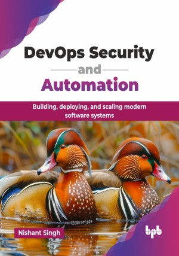

# DevOps Security and Automation

Building, deploying, and scaling modern software systems.

This is the repository for [DevOps Security and Automation
](https://bpbonline.com/products/devops-security-and-automation?_pos=1&_sid=ec5319f35&_ss=r&variant=44720530555080?variant=44720530555080),published by BPB Publications.

## About the Book
DevOps has emerged as a crucial methodology for streamlining processes, enhancing collaboration, and delivering high-quality software at scale. It is fundamentally changing how software is developed and delivered, focusing on speed, quality, and seamless collaboration.

This book equips readers with the knowledge and practical skills needed to excel in DevOps. From foundational concepts to advanced techniques, it covers the DevOps lifecycle, including version control, CI/CD, IaC, containerization, Kubernetes, observability, security integration, and site reliability engineering. Each chapter includes hands-on exercises using industry-standard tools like Docker, Jenkins, Terraform, and Prometheus.

By the end of this book, readers will have gained theoretical knowledge and practical experience to implement DevOps principles effectively, automate workflows, and drive innovation within their organization.

## What You Will Learn
• Build automated CI/CD pipelines with Jenkins and GitHub Actions.

• Implement IaC using Terraform and Ansible.

• Deploy containerized applications with Docker and Kubernetes.

• Integrate security practices into DevOps workflows.

• Apply site reliability engineering principles for system reliability.

• Automate testing strategies, including TDD and BDD approaches.

• Provision cloud IaC using Terraform and Ansible.
